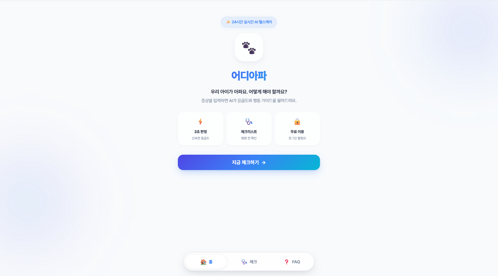
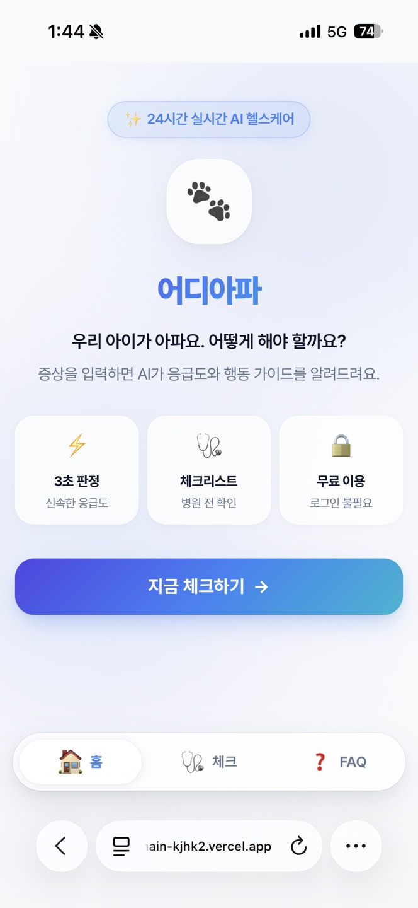

# 🌐 [어디아파 ]

## 📖 1. 서비스 소개

## 🔗 배포 링크 & 스크린샷

### 배포 URL
> 🌍 https://cod-a1-3-git-main-kjhk2.vercel.app/

### GitHub
> 📦 https://github.com/tikita12/cod-A1-3

### 스크린샷
| 데스크톱 | 모바일 |
|---------|--------|
|  |  |

> 테스트 환경: Edge (windowsOS), Safari (iPhone 16, iOS 17)

### 서비스명
> 어디아파 🐾

### 한 줄 소개
> 반려동물 증상을 입력하면 응급도와 대처법을 알려주는 AI 도우미

### 서비스 목적
> 반려동물이 갑자기 아플 때, 보호자들은 인터넷에 
증상을 검색하지만 정보가 너무 많고 이 것을 다 읽을 정신도 없습니다.
"지금 당장 병원을 가야 하나? 아니면 지켜봐도 되나?"
이 판단을 AI가 도와주기 위해 만들었습니다.

### 타겟 사용자
- 반려동물 초보 집사
- 밤/주말에 갑자기 아플 때 당황하는 보호자
- "이거 병원 가야 하나?" 고민하는 사람

### 제공하는 가치
- ✅ 밤/주말에도 즉시 응급도 판단 가능
- ✅ 병원 가기 전 뭘 확인해야 할지 알 수 있음
- ✅ 불필요한 걱정 or 방치 상황 예방

---

## 🎨 2. 페이지 구성 (최소 3개 이상 필수!)

> 💡 단일 페이지(index.html) 안에서 JavaScript로 섹션을 전환합니다.
>    (페이지 새로고침 없이 하단 메뉴로 이동)

### 페이지 1: [Main]
>         🐾 어디아파  
>        
>   우리 아이가 아파요. 어떻게 해야 할까요?
>   증상을 입력하면 AI가 응급도를 알려드려요
>        
>        [ 지금 체크하기 → ]

### 섹션 2: 증상 체크 (Check)
> 증상 입력 폼(동물종류/나이/증상/지속기간)
> → AI 응급도 판정 결과가 **같은 화면 하단**에 표시됨:
>   1. 응급도 등급 (🔴즉시 / 🟡24시간내 / 🟢경과관찰)
>   2. 병원 가기 전 체크리스트
>   3. 위험 신호 리스트
>   4. ⚠️ 면책 문구

### 섹션 3: FAQ
> 자주 묻는 질문 + 서비스 이용 안내 + 면책 조항

### (예정) 병원 찾기 (Hospital)
> 지역별 병원 안내 — 추후 확장 예정

### 네비게이션 방식
> 하단 메뉴바 선택으로 페이지 이동 → 섹션 전환 (새로고침 없음)

---

## 🤖 3. AI 기능 (최소 1개 필수!)

### 기능 이름
> AI 응급도 체커

### 사용하는 AI API
> OpenAI + gpt-5-mini

### 입력
> 입력: 동물 종류(강아지/고양이/기타), 나이, 증상, 지속기간

### 출력 (응답 JSON 스키마)

| 필드 | 타입 | 필수 | 설명 |
|------|------|------|------|
| `emergency_level` | string | ✅ | 응급도 (🔴즉시/🟡24시간내/🟢경과관찰) |
| `checklist` | string[] | ✅ | 병원 가기 전 확인할 것 |
| `warning_signs` | string[] | ✅ | 즉시 병원 신호 |
| `disclaimer` | string | ✅ | 면책 문구 |

### 📌 샘플 입력 → 출력 예시

**입력:**
```json
{
  "animal": "강아지",
  "age": "3살",
  "symptom": "구토를 계속해요",
  "duration": "6시간"
}
```


**출력:**
```json
{
  "emergency_level": "🟡24시간 내",
  "checklist": ["물을 마시는지 확인", "구토물에 피가 있는지 확인", "기운이 있는지 관찰"],
  "warning_signs": ["구토물에 피가 섞임", "축 늘어져 반응 없음"],
  "disclaimer": "이 정보는 참고용이며 정확한 진단은 수의사에게 받으세요."
}
```


### 사용자에게 주는 가치
> 걱정되는데 검색 결과는 너무 많죠? 불안한 상황에서 명확한 다음 행동을 알려줍니다

### 실패 처리 기준 (최소 1개 필수!)
| 상황 | 처리 방식 | HTTP 상태 코드 |
| :--- | :--- | :--- |
| **빈 입력** (동물/증상 누락) | "동물 종류와 증상을 모두 입력해주세요" 메시지 반환 | `400` (Bad Request) |
| **긴 입력** (500자 초과) | 앞 500자만 잘라서 사용 (길이 제한 적용) | `200` (OK) |
| **API/파싱 오류** | "일시적 오류입니다. 잠시 후 다시 시도해주세요" 메시지 반환 | `500` (Internal Server Error) |
| **통신 오류** | 프론트엔드 UI에서 에러 카드 표시 | - (Network Error) |

---

## 🛠 4. 기술 스택

### 프론트엔드
> HTML / CSS / JavaScript (바닐라) — **React/Vue 금지**임을 명심!

### 백엔드
> Vercel Serverless Functions (Python, BaseHTTPRequestHandler) — api/ 폴더에 넣음

### AI API
> OpenAI API (base_url을 Codyssey 학습 서버로 설정)

### 배포
> Vercel + GitHub

### 사용한 파이썬 패키지
> openai, python-dotenv

---

## 📁 5. 프로젝트 구조

> 어디아파/
> 
├── index.html          # 전체 페이지 (모든 섹션 포함)  
├── css/  
│   └── style.css       # 스타일 (섹션 전환, 반응형, 결과 카드)  
├── js/  
│   └── main.js         # 프론트 로직 (섹션 전환 + fetch API 호출)  
├── api/  
│   └── check.py        # Vercel Serverless 함수  
├── .env                # API 키 (git 제외  )
├── .gitignore  
├── requirements.txt  
└── README.md  

> 요청흐름/
[사용자 입력]  
     ↓ (폼 제출)  
[main.js] --- fetch POST /api/check ---> [check.py]  
     ↑                                          ↓  
     |                                [OpenAI(Codyssey) 호출]  
     |                                          ↓  
[결과 카드 렌더링] <--- JSON 응답 --- [JSON 파싱 & 응답]  

## 🚀 6. 실행 및 배포 방법

### 로컬 실행

# 1. 저장소 클론
git clone https://github.com/[tikita12]/cod-A1-3.git
cd cod-A1-3

# 2. 패키지 설치
pip install -r requirements.txt

# 3. 환경변수 설정 (.env 파일 생성)
OPENAI_API_KEY=본인_키_입력

# 4. Vercel 로컬 서버 실행
vercel dev

### 배포
GitHub에 push → Vercel이 자동 배포  
환경변수 OPENAI_API_KEY는 Vercel 대시보드 > Settings >   Environment Variables에 등록

## 🔐 7. 보안 & 환경변수 정책
-왜 환경변수를 사용하나?  
> 보안: API 키를 코드에 직접 쓰면 GitHub 공개 시 유출 → 요금 폭탄/오남용 위험  
> 운영 편의: 키 변경 시 코드 수정 없이 환경변수만 교체  
> 환경 분리: 로컬(.env)과 배포(Vercel 환경변수)를 분리 관리    

-키 유출 시 대응 절차  
> OpenAI/Codyssey 대시보드에서 해당 키 즉시 폐기(revoke)  
> 새 키 발급 후 Vercel 환경변수 교체  
> .gitignore에 .env 등록 확인  
> 이미 커밋됐다면 git rm --cached .env 후 재푸시  

## 🐛 8. 장애 대응 & 재배포 절차
-문제 발생 시: 
> Vercel 로그 확인: 대시보드 > 프로젝트 > Logs (또는 Functions 탭)  
> print("에러:", ...) 출력으로 원인 파악  
> 로컬에서 vercel dev로 재현 & 수정  
> git commit → git push → Vercel 자동 재배포  
> 배포 완료(Status: Ready) 후 실제 URL에서 재확인  

>Vercel 로그 확인: 대시보드 > 프로젝트 > Logs (또는 Functions 탭)  
>print("에러:", ...) 출력으로 원인 파악  
>로컬에서 vercel dev로 재현 & 수정  
>git commit → git push → Vercel 자동 재배포  
>배포 완료(Status: Ready) 후 실제 URL에서 재확인  

## 🚀 9. 향후 개선 & 확장 계획
-응답 지연 개선  
> 자주 묻는 증상은 캐시 활용 검토  
> 간단한 판정은 경량 모델, 복잡한 경우만 상위 모델 사용  
> 프롬프트 요약으로 토큰 절감  

-기능 확장
> 병원 찾기 (지역별 응급 동물병원 안내)  
> 증상 히스토리 저장  
> 사진 업로드 기반 판정  